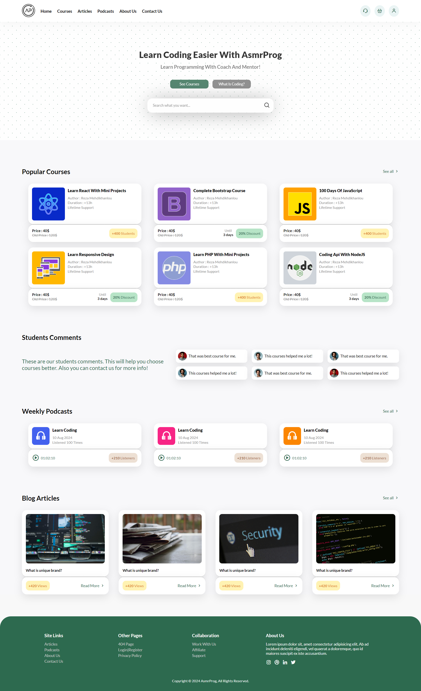

# Responsive Educational Website

In this tutorial ([Open in Youtube](https://youtu.be/laoPpthez3Q)),  I'll guide you step-by-step as we construct a sleek and functional website tailored for learners of all kinds. From HTML markup to CSS styling, we'll cover everything you need to know to create a responsive layout that looks great on desktops, tablets, and smartphones alike.

📝 Along the way, we'll explore key concepts such as media queries, flexbox divs, and fluid typography, empowering you to build websites that not only look professional but also provide an optimal user experience across various devices and screen sizes.

🚀 Whether you're a beginner looking to expand your coding skills or a seasoned developer seeking to enhance your understanding of responsive design principles, this tutorial has something for everyone. Join me as we embark on this coding journey together and unlock the potential of responsive web development!

# Screenshot
Here we have project screenshot :

